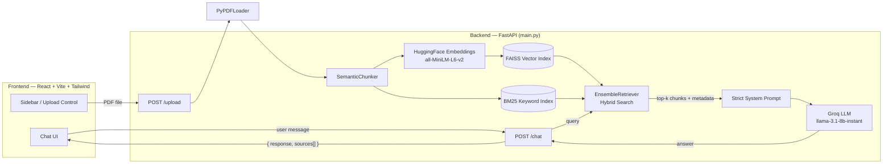
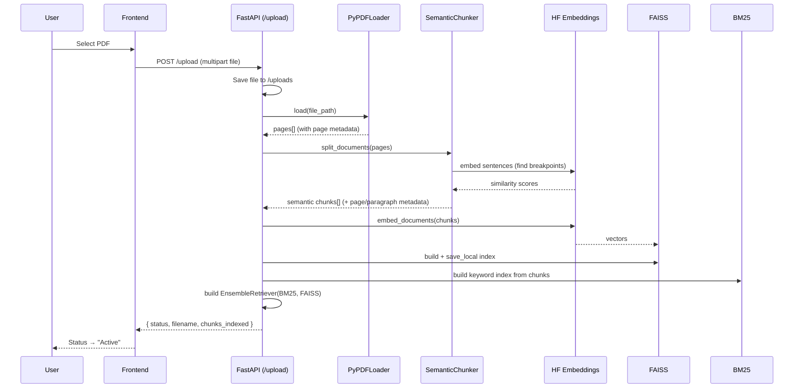
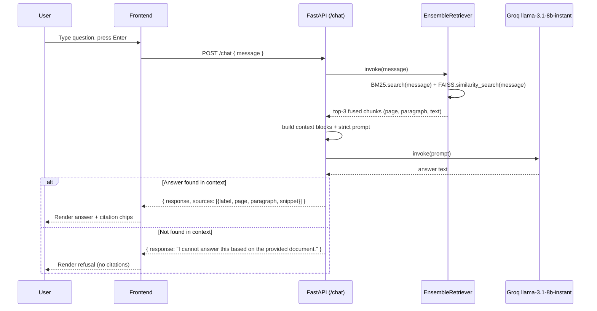

# qBotica RAG

An enterprise-styled, full-stack **Retrieval-Augmented Generation (RAG)** application. Upload a PDF, and chat with an AI assistant that answers **strictly from that document** — with page/paragraph-level source citations.

| Layer    | Stack                                                                          |
| -------- | ------------------------------------------------------------------------------ |
| Backend  | FastAPI · LangChain · FAISS · BM25 · HuggingFace Embeddings · Groq (Llama 3.1) |
| Frontend | React 19 · Vite · Tailwind CSS v4 · lucide-react                               |

---

## Table of Contents

- [Features](#features)
- [Architecture](#architecture)
- [Tech Stack](#tech-stack)
- [Project Structure](#project-structure)
- [Getting Started](#getting-started)
- [API Reference](#api-reference)
- [RAG Pipeline Details](#rag-pipeline-details)
- [Frontend UI Overview](#frontend-ui-overview)
- [Configuration](#configuration)
- [Limitations & Future Improvements](#limitations--future-improvements)

---

## Features

### Core RAG capabilities
- **PDF ingestion** — upload any PDF via `multipart/form-data`; it's parsed page-by-page with `PyPDFLoader`.
- **Semantic chunking** — instead of naive fixed-size character splitting, `SemanticChunker` (LangChain Experimental) groups sentences by *embedding similarity*, so chunks break at natural topic/paragraph boundaries rather than mid-sentence.
- **Hybrid search (dense + sparse)** — every query is run against:
  - a **FAISS** vector index (dense, semantic similarity via `all-MiniLM-L6-v2` embeddings), and
  - a **BM25** keyword index (sparse, exact-term/acronym/identifier matching),

  fused together with an `EnsembleRetriever` (50/50 reciprocal rank fusion) to get the best of both worlds.
- **Strict, grounded answers** — a hard system prompt forces the LLM (Groq `llama-3.1-8b-instant`) to answer *only* from retrieved context, and to reply with a fixed refusal sentence if the answer isn't present — no outside knowledge, no hallucinated facts.
- **Source citations** — every answer (when grounded) returns the supporting chunks' metadata: page number, in-page paragraph index, and a text snippet, so users can verify exactly where an answer came from.

### Frontend / UX
- **Two-pane "AI assistant" layout** — a dark navy sidebar (Knowledge Base status, upload control, tech stack badges) + a light chat workspace.
- **Live status indicator** — `Awaiting upload` (amber) → `Vectorizing…` (animated spinner) → `Active` (pulsing green), reflecting backend processing state.
- **Chat experience** — auto-scrolling message list, user/bot avatars, timestamps, fade-in message animations, "Synthesizing response…" typing indicator.
- **Clickable citation chips** — expandable "Source: Page X, Paragraph Y" pills under each answer reveal the underlying text snippet.
- **Auto-resizing input box** — multi-line composer (Enter to send, Shift+Enter for newline), disabled until a document is indexed.
- **New Conversation** — clears the chat thread without re-uploading/re-indexing the document.
- **Empty states** — friendly illustrations guiding the user before/after a document is indexed.

---

## Architecture

### High-level component diagram



### Document upload (indexing) flow



### Chat (retrieval + generation) flow



---

## Tech Stack

### Backend (`/backend`)

| Component             | Library / Service                    | Purpose                                                              |
| ---------------------- | ------------------------------------- | --------------------------------------------------------------------- |
| API framework          | **FastAPI** + **Uvicorn**             | REST API, CORS, async request handling                               |
| PDF parsing            | **pypdf** / `PyPDFLoader`             | Extracts per-page text and metadata from uploaded PDFs               |
| Chunking               | **LangChain Experimental** `SemanticChunker` | Splits text on semantic/structural boundaries, not raw character counts |
| Embeddings             | **HuggingFace** `sentence-transformers` (`all-MiniLM-L6-v2`) | Generates vector representations for chunks and queries |
| Dense retrieval        | **FAISS** (`faiss-cpu`)               | Vector similarity search index                                       |
| Sparse retrieval       | **rank-bm25** (`BM25Retriever`)       | Keyword/lexical search index                                          |
| Hybrid retrieval       | **LangChain** `EnsembleRetriever`     | Combines FAISS + BM25 via reciprocal rank fusion                      |
| LLM                     | **langchain-groq** → Groq Cloud (`llama-3.1-8b-instant`) | Generates grounded answers from retrieved context |
| Config                  | **python-dotenv**                     | Loads `GROQ_API_KEY` from `.env`                                      |

### Frontend (`/frontend`)

| Component        | Library                  | Purpose                                          |
| ----------------- | ------------------------- | --------------------------------------------------- |
| UI framework      | **React 19**              | Component-based SPA                              |
| Build tool        | **Vite**                  | Dev server + production bundling                 |
| Styling           | **Tailwind CSS v4**       | Utility-first styling, custom theme/fonts        |
| Icons             | **lucide-react**          | Bot, UploadCloud, Send, Loader2, FileText, etc.  |
| Font              | **Inter** (Google Fonts)  | Clean enterprise sans-serif typography           |

---

## Project Structure

```
Qbotica - RAG/
├── backend/
│   ├── main.py              # FastAPI app: /upload and /chat endpoints, RAG pipeline
│   ├── requirements.txt      # Python dependencies
│   ├── .env                  # GROQ_API_KEY (not committed)
│   ├── uploads/               # Saved PDF uploads
│   └── vectorstore/           # Persisted FAISS index (index.faiss / index.pkl)
│
├── frontend/
│   ├── index.html
│   ├── vite.config.js         # Vite + Tailwind plugin config
│   └── src/
│       ├── main.jsx
│       ├── App.jsx            # Top-level layout & state (chat, upload, status)
│       ├── constants.js        # API_BASE URL, STATUS enum
│       ├── index.css           # Tailwind import, fonts, animations
│       └── components/
│           ├── Sidebar.jsx          # Branding, knowledge base card, upload control
│           ├── ChatMessage.jsx      # Message bubble, avatar, citations
│           ├── ChatInput.jsx        # Auto-resizing input + send button
│           ├── TypingIndicator.jsx  # "Synthesizing response…" indicator
│           ├── EmptyState.jsx       # Pre/post-upload empty states
│           └── StatusBadge.jsx      # Awaiting / Vectorizing / Active badge
│
└── README.md
```

---

## Getting Started

### Prerequisites
- Python 3.11+
- Node.js 18+ / npm
- A [Groq API key](https://console.groq.com/) (free tier available)

### 1. Backend setup

```bash
cd backend
python -m venv venv

# Activate the virtual environment
venv\Scripts\activate        # Windows
source venv/bin/activate     # macOS/Linux

pip install -r requirements.txt
```

Create a `.env` file in `backend/`:

```env
GROQ_API_KEY=your_groq_api_key_here
```

Run the API:

```bash
uvicorn main:app --reload --port 8000
```

The backend is now available at `http://localhost:8000`.

> **Note:** The first request will download the `all-MiniLM-L6-v2` embedding model (~90 MB) from HuggingFace. Uploading a large PDF can take 1–2 minutes due to semantic chunking (it embeds every sentence to find optimal split points).

### 2. Frontend setup

```bash
cd frontend
npm install
npm run dev
```

The app is now available at `http://localhost:5173`. Make sure the backend is running on port 8000 (the frontend is hardcoded to call `http://localhost:8000` — see `src/constants.js`).

---

## API Reference

### `GET /`
Health check.

```json
{ "status": "ok", "service": "Qbotica RAG API" }
```

### `POST /upload`
Uploads a PDF, builds the semantic chunks, and (re)builds the hybrid retriever. **Replaces** any previously indexed document.

- **Request**: `multipart/form-data`, field `file` (must be a `.pdf`)
- **Response** `200 OK`:
  ```json
  {
    "status": "success",
    "filename": "Eye of the Needle.pdf",
    "chunks_indexed": 741
  }
  ```
- **Errors**:
  - `400` — file isn't a PDF, or no extractable text was found
  - `500` — PDF processing failed

### `POST /chat`
Answers a question using only the currently indexed document.

- **Request**:
  ```json
  { "message": "What rank was someone promoted to?" }
  ```
- **Response** `200 OK` (grounded answer):
  ```json
  {
    "response": "Lieutenant-colonel.",
    "sources": [
      {
        "label": "Page 60, Paragraph 1",
        "page": 60,
        "paragraph": 1,
        "snippet": "“Oh, no, sir. You’ve been promoted twice in your absence..."
      }
    ]
  }
  ```
- **Response** `200 OK` (no answer in document — `sources` omitted):
  ```json
  { "response": "I cannot answer this based on the provided document." }
  ```
- **Errors**:
  - `400` — no document has been uploaded yet
  - `500` — `GROQ_API_KEY` missing or LLM request failed

---

## RAG Pipeline Details

1. **Load** — `PyPDFLoader` extracts one `Document` per page, each tagged with `metadata.page` (0-indexed).
2. **Semantic chunk** — `SemanticChunker(embeddings)` splits each page's text into chunks at points where consecutive sentences' embeddings diverge most (a "breakpoint"), preserving coherent thoughts/paragraphs.
3. **Tag paragraphs** — chunks are numbered sequentially within their source page (`metadata.paragraph`), enabling human-readable citations like *"Page 4, Paragraph 2"*.
4. **Index (dual)**:
   - **FAISS**: chunks are embedded with `all-MiniLM-L6-v2` and stored in a vector index (persisted to `backend/vectorstore/`).
   - **BM25**: the same chunks are indexed for lexical/keyword search.
5. **Hybrid retrieval** — on each chat query, `EnsembleRetriever` queries both indexes (k=3 each) and fuses the ranked results (50% BM25 / 50% FAISS) via reciprocal rank fusion; the top 3 fused results are kept.
6. **Strict prompting** — retrieved chunks are wrapped with their `[Page X, Paragraph Y]` label and inserted into a system prompt that:
   - forbids using outside knowledge,
   - requires answers to be derived solely from the provided context,
   - mandates an exact refusal string (`"I cannot answer this based on the provided document."`) when the answer isn't present.
7. **Citations** — if the LLM's answer is *not* the refusal string, the backend attaches the `sources` array (label, page, paragraph, snippet) so the frontend can render verifiable citation chips.

---

## Frontend UI Overview

- **Sidebar** (`Sidebar.jsx`): qBotica branding, a "Knowledge Base" card showing the live `StatusBadge`, the indexed filename + chunk count, the upload/replace button (hidden file input, PDF only), a "New Conversation" reset, and a footer of tech badges.
- **Chat area** (`App.jsx` + `ChatMessage.jsx`): scrollable message list with avatars, timestamps, and fade-in animations. Bot messages with grounded answers show clickable citation chips (`Citation` component) that expand to reveal the source text snippet.
- **Typing indicator** (`TypingIndicator.jsx`): shown while waiting for `/chat` to respond.
- **Input console** (`ChatInput.jsx`): auto-growing textarea + send button, disabled until the knowledge base status is `Active`.
- **Empty states** (`EmptyState.jsx`): contextual guidance — "upload a document" before indexing, "ask away" once a document is active.

### Color & branding theme

| Token            | Value      | Usage                                  |
| ----------------- | ---------- | ----------------------------------------- |
| Deep navy         | `#0a192f`  | Sidebar background, user message bubbles |
| Electric blue     | `blue-500` / `blue-600` | Accents, buttons, links, avatars |
| Crisp white       | `white`    | Bot message bubbles, main background     |
| Font              | `Inter`    | Headings & body text                     |

---

## Configuration

| Variable          | Location               | Description                                  |
| ------------------ | ----------------------- | ----------------------------------------------- |
| `GROQ_API_KEY`     | `backend/.env`          | Required for `/chat` to call the Groq LLM      |
| `API_BASE`         | `frontend/src/constants.js` | Backend URL the frontend calls (default `http://localhost:8000`) |
| `RETRIEVER_K`      | `backend/main.py`       | Number of chunks retrieved per query (default `3`) |
| LLM model          | `backend/main.py` → `get_llm()` | Groq model name (`llama-3.1-8b-instant`) |
| Embedding model    | `backend/main.py`       | HuggingFace model (`all-MiniLM-L6-v2`)         |

---

## Limitations & Future Improvements

- **Single active document** — uploading a new PDF replaces the previous index (no multi-document/session support).
- **In-memory retriever** — the BM25 index and `EnsembleRetriever` are rebuilt on each upload and live only in process memory; restarting the backend requires re-uploading the PDF (the FAISS index is persisted to disk, but BM25 is not).
- **Upload latency** — `SemanticChunker` embeds every sentence to find breakpoints, which can take 1–2 minutes for large PDFs.
- **No authentication** — CORS is open to all origins; not intended for production deployment as-is.
- **Possible enhancements**: multi-document knowledge bases, persistent BM25/session storage, streaming LLM responses, PDF preview with highlighted citation regions, conversation history persistence.
